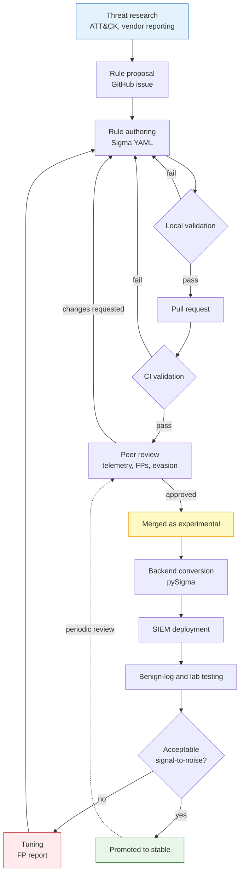
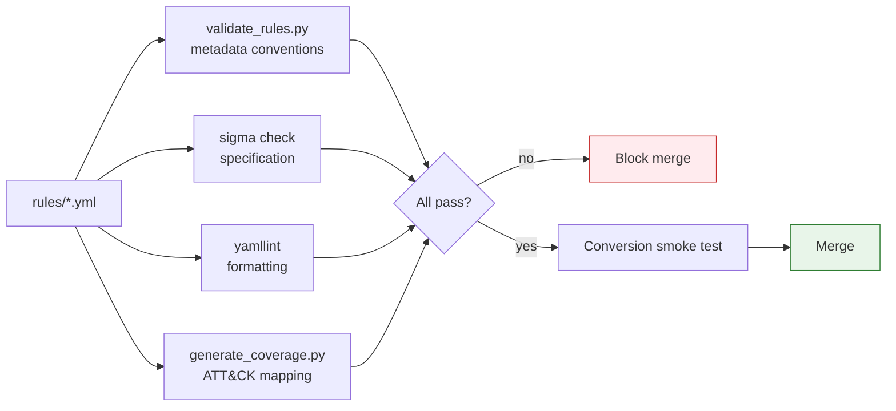
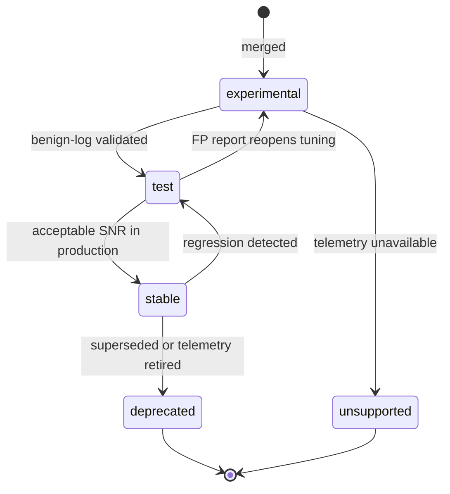

<div align="center">

# Sigma MITRE Detection Rules

**Vendor-neutral Sigma detection rules mapped to MITRE ATT&CK**

Practical, explainable detections across Windows, Linux, web, network,
AWS, and Microsoft 365 telemetry.

[](https://github.com/maryamoah/sigma-mitre-detection-rules/actions/workflows/sigma-validation.yml)
[](https://github.com/maryamoah/sigma-mitre-detection-rules/actions/workflows/lint.yml)
[](LICENSE)

[](https://github.com/SigmaHQ/sigma-specification)
[](https://attack.mitre.org/)
[](#rule-lifecycle)
[](CONTRIBUTING.md)

[Quick Start](#quick-start) ·
[Rules](#rule-categories) ·
[Coverage](#mitre-attck-coverage) ·
[Contributing](CONTRIBUTING.md) ·
[Roadmap](#roadmap)

</div>

---

> [!IMPORTANT]
> **Project status: Experimental.** Rules here are derived from public
> research and Sigma taxonomy conventions, not from validation against
> production telemetry at scale. Test and tune every rule against your own
> data before enabling alerting. Deploying untuned detections has a real
> cost: alert fatigue degrades a SOC's ability to respond to genuine
> incidents.

## About

This repository is a detection engineering portfolio built around a single
principle: **a detection rule is only as good as the reasoning behind it.**

Every rule states the telemetry it depends on, the attacker behaviour it
targets, the benign activity that resembles it, and the ways an informed
attacker would evade it. Rules that cannot answer those questions are not
merged, regardless of how many ATT&CK techniques they would add to a
coverage chart.

Sigma was chosen because it is backend-agnostic. A rule written once can be
converted to Splunk SPL, Elastic Lucene or ES|QL, Microsoft Sentinel KQL,
QRadar AQL, or Wazuh — which means the detection logic can be reviewed on its
merits rather than through the syntax of one vendor's query language.

### What this repository is not

- Not a replacement for [SigmaHQ][sigmahq]. That is the canonical community
  ruleset and is far larger. This repository is original work maintained to a
  narrower scope.
- Not a turnkey deployment. Field names, log source coverage, and normalisation
  differ between environments. Expect to map fields to your own data model.
- Not a coverage-maximisation exercise. Techniques are covered where a
  meaningful detection exists, and left uncovered where one does not.

[sigmahq]: https://github.com/SigmaHQ/sigma

---

## Table of contents

- [Quick start](#quick-start)
- [Installation](#installation)
- [Architecture](#architecture)
- [Repository structure](#repository-structure)
- [Supported platforms](#supported-platforms)
- [Supported SIEMs](#supported-siems)
- [Supported log sources](#supported-log-sources)
- [MITRE ATT&CK coverage](#mitre-attck-coverage)
- [Rule categories](#rule-categories)
- [Sigma overview](#sigma-overview)
- [Anatomy of a rule](#anatomy-of-a-rule)
- [Rule lifecycle](#rule-lifecycle)
- [Validation](#validation)
- [Testing](#testing)
- [Detection philosophy](#detection-philosophy)
- [Known limitations](#known-limitations)
- [Roadmap](#roadmap)
- [Contributing](#contributing)
- [References](#references)
- [License](#license)

---

## Quick start

```bash
git clone https://github.com/maryamoah/sigma-mitre-detection-rules.git
cd sigma-mitre-detection-rules

python -m venv .venv && source .venv/bin/activate
python -m pip install -r requirements-dev.txt

# Validate the ruleset
python scripts/validate_rules.py
sigma check rules/

# Convert a rule to your SIEM
sigma convert -t splunk -p splunk_windows rules/windows/
```

<!-- TODO: replace with a terminal recording or screenshot of the above.
     asciinema or a simple screenshot of `sigma check rules/` output works.
     Store under docs/assets/ and reference here. -->

<div align="center">
  <em>Screenshot: validation output — see <code>docs/assets/</code></em>
</div>

---

## Installation

### Requirements

| Requirement | Version | Purpose |
| --- | --- | --- |
| Python | 3.9 or later | Validation scripts and Sigma CLI |
| Sigma CLI | 1.0 or later | Specification checking and conversion |
| Backend plugin | Varies | One per target SIEM |

### Install

```bash
python -m pip install -r requirements-dev.txt
```

This installs PyYAML, Sigma CLI, and yamllint. Backend plugins are installed
separately through Sigma CLI, which resolves plugin compatibility against the
installed pySigma version:

```bash
sigma plugin list
sigma plugin install splunk
sigma plugin install elasticsearch
sigma plugin install microsoft365defender
```

---

## Architecture

Detection content in this repository moves through a defined path from
research to deployment. The feedback loop from production back into tuning is
the part that matters most — a rule that never receives tuning feedback stays
experimental indefinitely.



### Validation pipeline



---

## Repository structure

```text
sigma-mitre-detection-rules/
├── .github/
│   ├── ISSUE_TEMPLATE/          Bug, feature, rule proposal, FP report
│   ├── workflows/               Validation and linting pipelines
│   ├── CODEOWNERS
│   └── PULL_REQUEST_TEMPLATE.md
├── docs/                        Architecture, guides, philosophy, FAQ
├── examples/                    SIEM conversion notes and sample queries
├── mappings/                    ATT&CK coverage and Navigator layer
├── rules/                       Sigma detections grouped by platform
│   ├── windows/
│   ├── linux/
│   ├── web/
│   ├── network/
│   ├── cloud/aws/
│   └── cloud/m365/
├── scripts/
│   ├── validate_rules.py        Metadata and convention validation
│   └── generate_coverage.py     ATT&CK coverage and Navigator layer
├── CHANGELOG.md
├── CONTRIBUTING.md
├── SECURITY.md
└── requirements-dev.txt
```

<!-- TODO: verify the rules/ subdirectory names above match your actual
     layout, and adjust if they differ. -->

---

## Supported platforms

| Platform | Primary telemetry | Notes |
| --- | --- | --- |
| Windows | Sysmon, Security event log | Richest coverage; Sysmon strongly recommended |
| Linux | auditd, syslog | Requires an audit ruleset that captures execution |
| Web | Server access logs | Apache, Nginx, IIS combined-log formats |
| Network | Proxy, DNS, firewall | Field names vary considerably by vendor |
| AWS | CloudTrail | Management events; data events where noted |
| Microsoft 365 | Unified Audit Log, Entra ID | Requires auditing enabled per workload |

---

## Supported SIEMs

Conversion is handled by [pySigma][pysigma] backends. Conversion notes and
platform-specific caveats live in [`examples/`](examples/).

| SIEM | Backend | Target | Notes |
| --- | --- | --- | --- |
| Splunk | `pySigma-backend-splunk` | SPL | Mature; `splunk_windows` pipeline |
| Elastic | `pySigma-backend-elasticsearch` | Lucene, ES\|QL, EQL | Use an ECS pipeline |
| Microsoft Sentinel | `pySigma-backend-microsoft365defender` | KQL | Table names vary by connector |
| QRadar | `pySigma-backend-QRadar-aql` | AQL | Field mapping usually required |
| Wazuh | Manual translation | XML rules | No maintained pySigma backend |

> [!NOTE]
> Successful conversion proves a backend can express the logic. It proves
> nothing about whether the logic catches the behaviour in your environment.
> Always validate against real data.

[pysigma]: https://github.com/SigmaHQ/pySigma

---

## Supported log sources

| Log source | `product` / `category` | Required configuration |
| --- | --- | --- |
| Windows process creation | `windows` / `process_creation` | Sysmon Event ID 1, or Security 4688 with command line auditing |
| Windows PowerShell | `windows` / `ps_script` | Script block logging (Event ID 4104) |
| Windows authentication | `windows` / `security` | Logon auditing (4624, 4625, 4648) |
| Linux process execution | `linux` / `process_creation` | auditd `execve` rules |
| Web access | `apache`, `nginx`, `iis` | Combined log format including user agent |
| DNS | `dns` | Query logging with client attribution |
| AWS | `aws` / `cloudtrail` | Trail enabled across all regions |
| Microsoft 365 | `m365` | Unified Audit Log enabled |

Rules declare their telemetry dependency explicitly. If you do not collect the
log source a rule declares, that rule will never fire — this is the most
common reason a deployed ruleset appears silent.

---

## MITRE ATT&CK coverage

Coverage is **generated from rule tags**, not maintained by hand, so it cannot
drift away from the ruleset:

```bash
python scripts/generate_coverage.py
```

This writes two artefacts:

- [`mappings/attack-coverage.md`](mappings/attack-coverage.md) — coverage by
  tactic, log source, maturity, and severity, plus a full rule inventory.
- [`mappings/attack-navigator-layer.json`](mappings/attack-navigator-layer.json)
  — upload to the [ATT&CK Navigator][nav] to visualise coverage.

[nav]: https://mitre-attack.github.io/attack-navigator/

<!-- TODO: after running generate_coverage.py, export a Navigator screenshot
     to docs/assets/attack-coverage.png and reference it here. A coverage
     heatmap is the single most effective visual for this repository. -->

<div align="center">
  <em>Screenshot: ATT&CK Navigator coverage layer — see <code>docs/assets/</code></em>
</div>

> [!WARNING]
> **Coverage is not effectiveness.** A technique marked as covered means a
> rule exists that targets some procedure under it. ATT&CK techniques are
> broad; most contain procedures no single rule detects. Treat coverage as a
> map of what has been attempted, not a measure of defensive strength.

---

## Rule categories

The ruleset spans six telemetry domains. Exact per-category counts are
generated into [`mappings/attack-coverage.md`](mappings/attack-coverage.md).

| Category | Focus |
| --- | --- |
| **Windows** | Credential access, execution, persistence, defence evasion |
| **Linux** | Execution, persistence, privilege escalation |
| **Web** | Initial access, exploitation of public-facing applications |
| **Network** | Command and control, exfiltration, discovery |
| **AWS** | Defence evasion, persistence, credential access in CloudTrail |
| **Microsoft 365** | Initial access, persistence, collection in Entra ID and Exchange |

---

## Sigma overview

[Sigma][sigma] is an open, YAML-based signature format for log events —
generic in the way Snort is for network traffic and YARA is for files. A rule
describes _what to look for_ in a backend-neutral way; a converter turns that
into a query for a specific SIEM.

The practical consequence for detection engineering: logic is portable, and it
is reviewable. A Sigma rule can be read and critiqued by someone who has never
used your SIEM.

Core structure:

| Section | Purpose |
| --- | --- |
| Metadata | `title`, `id`, `status`, `description`, `author`, `references` |
| `logsource` | The telemetry the rule requires |
| `detection` | Named selections and a boolean `condition` |
| `falsepositives` | Known benign sources of matches |
| `level` | Expected severity |
| `tags` | ATT&CK tactics and techniques |

[sigma]: https://github.com/SigmaHQ/sigma

---

## Anatomy of a rule

The example below illustrates the metadata standard every rule in this
repository is held to. Note that the interesting content is the
`falsepositives` block and the `filter_` selections — that is where detection
engineering actually happens.

```yaml
title: LSASS Memory Access via comsvcs.dll MiniDump
id: 3c1e5a7f-9b2d-4e8a-a6c4-1f0d7b5e3a92
status: experimental
description: |
    Detects use of rundll32.exe to invoke the MiniDump export of comsvcs.dll
    against the LSASS process. This is a living-off-the-land technique for
    credential theft that avoids dropping a dedicated dumping tool to disk.
    The signal is the combination of comsvcs, MiniDump, and a process ID
    argument -- not rundll32 itself, which is extremely common.
references:
    - https://attack.mitre.org/techniques/T1003/001/
    - https://lolbas-project.github.io/lolbas/Libraries/Comsvcs/
author: Mary Amoah
date: 2026-08-02
modified: 2026-08-02
tags:
    - attack.credential_access
    - attack.t1003.001
logsource:
    product: windows
    category: process_creation
    definition: >
        Requires Sysmon Event ID 1 or Security Event ID 4688 with command
        line auditing enabled.
detection:
    selection_img:
        - Image|endswith: '\rundll32.exe'
        - OriginalFileName: 'RUNDLL32.EXE'
    selection_cli:
        CommandLine|contains|all:
            - 'comsvcs'
            - 'MiniDump'
    filter_optional_backup:
        ParentImage|startswith: 'C:\Program Files\<BackupVendor>\'
    condition: selection_img and selection_cli and not 1 of filter_optional_*
falsepositives:
    - Endpoint backup and forensic agents that legitimately dump process
      memory. Verify the parent process before excluding.
    - Vendor diagnostic tooling invoked during a support engagement.
level: high
```

**Why this rule is structured the way it is**

- `selection_img` matches both the filename and `OriginalFileName`, so a
  renamed copy of `rundll32.exe` is still caught.
- The filter is scoped to a specific parent path rather than excluding a
  filename globally — a broad exclusion is an attacker's easiest bypass.
- `level: high` rather than `critical`, because a legitimate backup agent
  can produce this pattern and the rule has not been validated at scale.
- `status: experimental`, because it has not been run against production
  telemetry over a meaningful period.

---

## Rule lifecycle

Every rule carries a `status` field reflecting genuine maturity.



| Status | Meaning |
| --- | --- |
| `experimental` | Logic derived from research; not validated at scale |
| `test` | Validated against benign logs; limited production exposure |
| `stable` | Acceptable signal-to-noise observed in production |
| `deprecated` | Superseded by a better rule, or the technique is obsolete |
| `unsupported` | Cannot function without telemetry most environments lack |

Most rules here are `experimental`, and that label is deliberate. Promotion
requires evidence, and evidence requires deployment feedback — which is why
[false positive reports][fp] are the most valuable contribution this project
can receive.

[fp]: https://github.com/maryamoah/sigma-mitre-detection-rules/issues/new?template=false_positive_report.yml

---

## Validation

Three layers run locally and in CI:

```bash
python scripts/validate_rules.py           # repository metadata conventions
sigma check rules/                         # Sigma specification compliance
yamllint rules/                            # formatting consistency
python scripts/generate_coverage.py --check  # ATT&CK tag and UUID audit
```

| Check | Catches |
| --- | --- |
| `validate_rules.py` | Missing metadata, convention violations |
| `sigma check` | Specification errors, malformed conditions, invalid logsource |
| `yamllint` | Indentation drift, trailing whitespace, duplicate keys |
| `generate_coverage.py --check` | Duplicate UUIDs, missing or malformed ATT&CK tags |
| Conversion smoke test | Logic a backend cannot express |

CI runs on every push and pull request across Python 3.11 and 3.12.

---

## Testing

Validation proves a rule is well-formed. Testing proves it detects something.

**Benign-log testing.** Run the rule against logs from normal activity. Any
match is a false positive by definition. This is the cheapest meaningful test
and catches the majority of over-broad logic.

**Adversary emulation.** Execute the technique in an isolated lab and confirm
the rule fires. [Atomic Red Team][art] provides scoped tests mapped to ATT&CK
technique IDs, which align directly with rule tags.

**Production shadow mode.** Deploy without alerting and measure volume over
one to two weeks. A rule producing hundreds of daily matches needs tuning
regardless of how sound the logic looks.

> [!CAUTION]
> Run adversary emulation only in an isolated lab you own, never against
> production systems or systems you do not have written authorisation to test.

Testing evidence is documented in each pull request. Where a rule is untested,
it says so — an honest gap is more useful than an unsupported claim.

[art]: https://github.com/redcanaryco/atomic-red-team

---

## Detection philosophy

**Behaviour over indicators.** A rule matching one hash or filename is
obsolete the moment an attacker recompiles. Rules target behaviour that is
costly for an attacker to change.

**Explainability is a requirement.** An analyst receiving an alert at 3 a.m.
needs to know what fired, why it matters, and what to check next. A rule that
cannot explain itself generates work rather than reducing it.

**Telemetry dependencies are stated.** Every rule declares what it needs.
Silent failure due to missing log sources is a leading cause of false
confidence in a detection programme.

**False positives are documented honestly.** `falsepositives: Unknown` usually
means the author did not look. Realistic benign sources are listed so that
tuning starts from knowledge rather than from surprise.

**Coverage is not the goal.** Writing a weak rule to claim a technique makes
the coverage chart greener and the SOC no safer. Techniques are left uncovered
where no meaningful detection exists at this telemetry level.

---

## Known limitations

Stated plainly, because a repository that lists none is not being honest:

- **Most rules are untested at scale.** They are derived from public research,
  not from production validation.
- **Field names vary between environments.** Sigma's taxonomy normalises much,
  but ingestion pipelines differ. Expect to map fields.
- **Windows coverage assumes Sysmon.** Rules relying on Sysmon-specific fields
  degrade or fail on Security-log-only telemetry.
- **Network rules are the least portable.** Proxy and firewall schemas are
  heavily vendor-specific.
- **Wazuh requires manual translation.** No maintained pySigma backend exists.
- **No detection is evasion-proof.** Every rule can be bypassed by an attacker
  who knows it exists. Documented evasion paths are a feature.

See [`docs/known-limitations.md`](docs/known-limitations.md) for detail.

---

## Roadmap

Directional, not a delivery commitment.

**Near term**

- [ ] Promote rules from `experimental` to `test` as validation evidence accrues
- [ ] Benign-log test fixtures for the highest-volume rules
- [ ] Expanded conversion examples per backend
- [ ] ATT&CK Navigator layer published with each release

**Medium term**

- [ ] Atomic Red Team test IDs referenced in rule metadata
- [ ] Correlation rules using the Sigma v2 correlation specification
- [ ] Linux auditd coverage expansion
- [ ] Kubernetes and container telemetry

**Longer term**

- [ ] Automated regression testing against a benign log corpus
- [ ] Per-rule detection quality scoring
- [ ] Deployment packaging per SIEM

---

## Contributing

Contributions are welcome. A well-reasoned false positive report is worth more
than a rule nobody has tested.

Start with [CONTRIBUTING.md](CONTRIBUTING.md), which covers rule requirements,
validation, review expectations, and testing evidence.

| I want to... | Use |
| --- | --- |
| Propose a detection | [New rule proposal][nr] |
| Report benign matches | [False positive report][fp] |
| Report broken logic | [Bug report][br] |
| Suggest tooling or docs | [Feature request][fr] |

[nr]: https://github.com/maryamoah/sigma-mitre-detection-rules/issues/new?template=new_rule_proposal.yml
[br]: https://github.com/maryamoah/sigma-mitre-detection-rules/issues/new?template=bug_report.yml
[fr]: https://github.com/maryamoah/sigma-mitre-detection-rules/issues/new?template=feature_request.yml

Security issues follow [SECURITY.md](SECURITY.md) — do not open a public issue.

---

## References

**Specification and tooling**

- [Sigma Specification](https://github.com/SigmaHQ/sigma-specification)
- [SigmaHQ rule repository](https://github.com/SigmaHQ/sigma)
- [pySigma](https://github.com/SigmaHQ/pySigma) ·
  [Sigma CLI](https://github.com/SigmaHQ/sigma-cli)

**Threat intelligence and modelling**

- [MITRE ATT&CK Enterprise](https://attack.mitre.org/matrices/enterprise/)
- [ATT&CK Navigator](https://mitre-attack.github.io/attack-navigator/)
- [MITRE D3FEND](https://d3fend.mitre.org/)

**Detection engineering practice**

- [Alerting and Detection Strategy Framework](https://github.com/palantir/alerting-detection-strategy-framework)
- [Detection Engineering Maturity Matrix](https://detectionengineering.io/)
- [Atomic Red Team](https://github.com/redcanaryco/atomic-red-team)
- [The Pyramid of Pain](https://detect-respond.blogspot.com/2013/03/the-pyramid-of-pain.html)

**Reference rulesets**

- [Elastic Detection Rules](https://github.com/elastic/detection-rules)
- [Splunk Security Content](https://github.com/splunk/security_content)
- [LOLBAS](https://lolbas-project.github.io/) ·
  [GTFOBins](https://gtfobins.github.io/)

---

## License

Released under the [MIT License](LICENSE).

Sigma is licensed separately by SigmaHQ. MITRE ATT&CK® is a registered
trademark of The MITRE Corporation; this project is not affiliated with or
endorsed by MITRE.

<div align="center">

**Maintained by [Mary Amoah](https://github.com/maryamoah)**

If this repository is useful to you, a star helps others find it.

</div>
